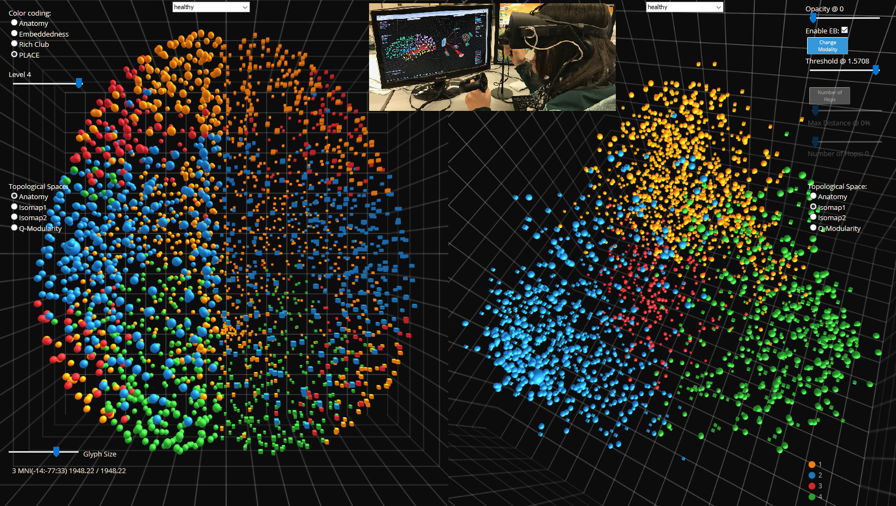
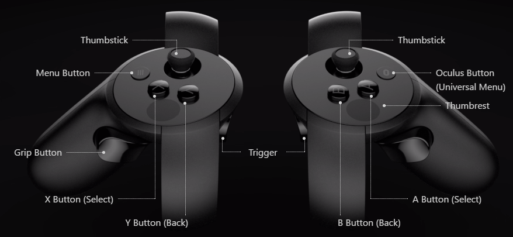

# NeuroCave

NeuroCave is a web-based tool that enables researchers to visualize connectome data in order to more effectively observe 
how the regions of the brain are interconnected. NeuroCave helps researchers to explore and analyze the intrinsic geometry 
of the brain by letting the user switch quickly between different topological spaces where the connectome is embedded. 
Our tool supports multiple, side-by-side viewing of one or more connectomes, facilitating group study analysis. With a 
simple and easy-to-use interface, users can explore all the connections with a edge-on-demand technique and to focus on 
very specific areas by toggling on and off regions of the brain as desired. Simple analytics such as nodal strength 
and shortest path trees can be computed on the fly. Our tool support explorations using VR techniques, and it is
compatible with the Oculus Rift headset and the Oculus Touch input accessory for nodal
selection. 

# Video documentation 

A short video presentation introducing the main features of NeuroCave can be found 
[here](https://dl.dropboxusercontent.com/u/571874/NeuroCave_VIS_2017.mp4).

# How to use it

The NeuroCave software is accessible [online](https://creativecodinglab.github.io/NeuroCave/). There is no need of 
installation since it is a web-based application. Users can upload and visualize their own data by pointed to a folder 
containing the data. The folder should contain 3 types of files:
- Network files: a ".csv" file per subject containing the adjacency matrix of the connectome.
- Topology files: a ".csv" file per subject containing the different topological and clustering information for each 
  region. Topological information are expected to be an (x,y,z) vector for each label. Clustering information are 
  expected to be an integer number starting with 1.
- Configuration file: a "index.txt" file that lists the available network and topology pair files and associates them 
  to the subject ID.

Please contact Johnson Keiriz at jgadel2@uic.edu (or create an issue on this GitHub repo) if you have any questions. 

# VR instructions

NeuroCave is fully compatible with the [Oculus Rift](https://www.oculus.com/). The application requires both the Oculus 
Rift and Oculus Touch for navigation and control. Currently, Firefox Nightly and Chromium are supported. Please check 
the [WebVR](https://webvr.rocks/) website for browsers that support the required hardware. Support to Gear VR will be 
added later.
- In order to enter VR mode, the user presses the letter 'v'. 
- The user then must choose which side to navigate: 's' for the left side and 'd' for the right side.
- The letter 'e' is used to exit VR mode.
- In VR mode, the user can use the thumbstick axes to zoom, pan and rotate. Pressing the grip button will speed up the
  navigation.
- In VR mode, the user can points to a node using the trigger button. In order to select a node, the user needs to press
  the grip button while pressing the trigger button.

# Color coding

NeuroCave allows different color coding schemas, such as:
- Anatomy - Nodes are grouped according to their neuroanatomical locations;
- Embeddedness - Nodes that have been shown to be highly embedded in the human structural connectome [1] are 
  highlighted;
- Rich-club - Rich-club nodes as defined by van den Heuval et al. [2] are highlighted. Note that the Rich-club regions 
  form a subset of highly-embedded nodes;
- Custom-defined - Users can create their own atlases.

# Testing

NeuroCave is available [here](https://creativecodinglab.github.io/NeuroCave/) for online testing. A paper introdcuing 
NeuroCave is currently under submission.

# Acknowledgment

NeuroCave Project members: 

Johnson Keiriz, Angus Forbes, Morris Chukhman, Olu Ajilore, and Alex D. Leow (University of Illinois at Chicago); Liang 
Zhan (University of Wisconsin-Stout). 

Software development was led by Johnson Keiriz, based on Conte et al.'s BRAINtrinsic tool [3,4]. Dr. Keirez is a member 
of the [Creative Coding Research Group](https://www.evl.uic.edu/creativecoding/), directed by Dr. Angus Forbes. The 
research group is part of the [Electronic Visualization Laboratory](https://www.evl.uic.edu) (EVL) at University of 
Illinois at Chicago (UIC).
This research is a collaboration with Dr. Alex Leow, Dr. Olusola Ajilore, and Dr. Allen Ye, all belonging 
to UIC Department of Psychiatry. NeuroCave has been used to support researchers at [CoNECt@UIC](http://conect.brain.uic.edu), 
an interdisciplinary team of researchers and clinicians devoted to improving the understanding of brain connectivity.

# References

**[1]** - Ye, A.Q., Zhan, L., Conrin, S., GadElKarim, J., Zhang, A., Yang, S., Feusner, J.D., Kumar, A., Ajilore, O.A., and Leow, A.D. (2015). Measuring embeddedness: Hierarchical scale‐dependent information exchange efficiency of the human brain connectome. Human Brain Mapping, 36(9): 3653-3665.

**[2]** - van den Heuvel, M.P. and Sporns, O. (2011). Rich-club organization of the human connectome. The Journal of Neuroscience, 31(44): 15775-15786.

**[3]** - Conte, G., Ye, A.Q., Forbes, A.G., Ajilore, O.A., and Leow, A.D. (2015). BRAINtrinsic: A virtual reality-compatible tool for exploring intrinsic topologies of the human brain connectome. In Y. Guo, K. Friston, A. Faisal, S. Hill, and H. Peng, editors, Brain Informatics and Health, volume 9250 of Lecture Notes in Artificial Intelligence, chapter 7, pages 67–76. Springer.

**[4]** - Ye, A.Q., Ajilore, O.A., Conte, G., GadElkarim, J., Thomas-Ramos, G., Zhan, L., Yang, S., Kumar, A., Magin, R.L., Forbes, A.G., and Leow, A.D. (2015). The intrinsic geometry of the human brain connectome. Brain informatics, 2(4), 197-210.

